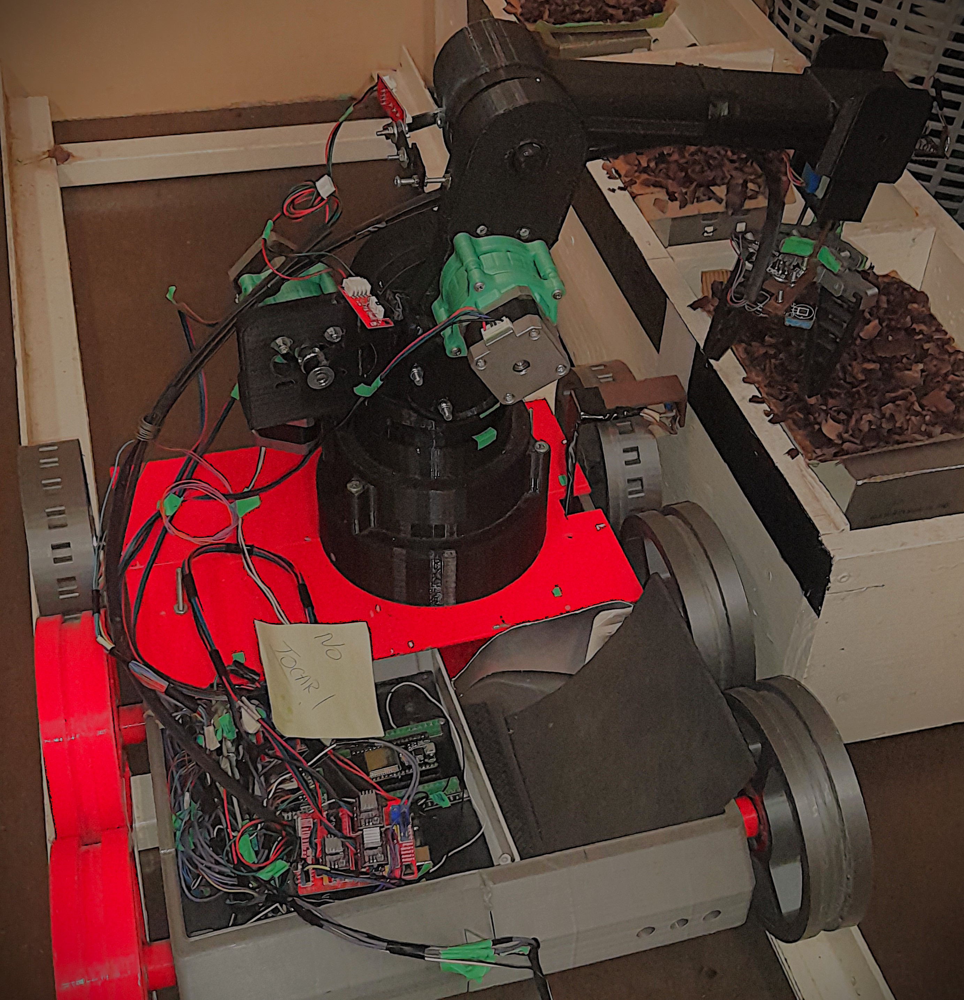

<h1 align="center" style="color:brown;">
  🐔🥚Robot Avícola V2.0
</h1>

Proyecto de la PPS en Ingeniería Mecatrónica realizado en la FI-UNLZ.

Sistema robótico de 3 GDL para realizar la recolección de huevos en nidos horizontales, tiene implementado un software con procesamiento de imágenes para la detección y localización en python utilizando la librería cv2 y un modelo pre-entrenado de roboflow. Se emplea IoT para el accionamiento de control del sistema, apliación para el envío de mensajes y recepción a través de "MQTT" además del monitoreo de variables ambientales cómo la temperatura, gas CO2, húmedad.

## 🟠Tecnologías Aplicadas
• ESP32 - Shield cnc 3 ejes, para el control de los motores nema 17, motores eléctricos de cc y sensores.
• Python - OpenCV, para el diseño de software de detección y calculo de la cinematica inversa
• Node-RED - MQTT, para el envío y recepción de mensajes
• Sensores de CO₂ MQ135, temperatura y humedad DHT11

## 🟠Prototipo REAL

  

## 🟠Modelo matemático (Cinemática inversa) Robot

En los siguientes ítems se describe el modelo cinemático inverso aplicado al robot de 3GDL por método geométrico
 🔹 Articulación de la base $$\(\theta_1)$$

Este ángulo se obtiene a partir de la proyección del punto de acción sobre el plano XY.  
Las rotaciones se consideran respecto al eje Z.

$$
\theta_1 = 2\arctan\left(\frac{py}{px}\right)
$$

🔹 Articulación del brazo $$\(\theta_2)$$

$$
A_1 = l_1 + l_2 \cos(\theta_3), \quad A_2 = l_2 \sin(\theta_3)
$$

La distancia proyectada sobre el plano XY es:

$$
d_p = p_x \cos(\theta_1) + p_y \sin(\theta_1)
$$

Relaciones trigonométricas:

$$
\sin(\theta_2) = \frac{p'_z A_1 - d_p A_2}{A_1^2 + A_2^2}
$$

$$
\cos(\theta_2) = \frac{d_p A_1 - p'_z A_2}{A_1^2 + A_2^2}
$$

Finalmente:

$$
\theta_2 = 2\arctan\left(\frac{\sin(\theta_2)}{\cos(\theta_2)}\right)
$$

🔹  Articulación del codo $$\(\theta_3)$$

Se ajusta en el plano vertical de la base, considerando la distancia entre el gripper y el extremo del codo.  

Paso1. Se calcula la coordenada corregida en Z:

$$\ p'_z = p_z - b \$$

Paso2. Distancia proyectada:

$$\ D^2 = p_x^2 + p_y^2 + (p'_z)^2 \$$

Paso3. Aplicando la ley de cosenos:

$$\cos(\theta_3) = \frac{D^2 - l_1^2 - l_2^2}{2 l_1 l_2}\$$

Paso4. Ángulo del codo:

$$\theta_3 = 2\arctan\left(\frac{\sqrt{1-\cos^2(\theta_3)}}{\cos(\theta_3)}\right)\$$

Configuración **codo arriba**

• Con estos tres coordenadas articulares $$\(\theta_1, \theta_2, \theta_3)\$$ se obtiene la **configuración del robot** para alcanzar cualquier punto dentro de su espacio de trabajo 17x13cm.

## 🟠Video del Prototipo en funcionamiento

[Link de Google Drive](https://drive.google.com/file/d/1ZrKL6yfj1HvtoRiwAzGiAirnJcBjSen1/view?usp=drive_link)

