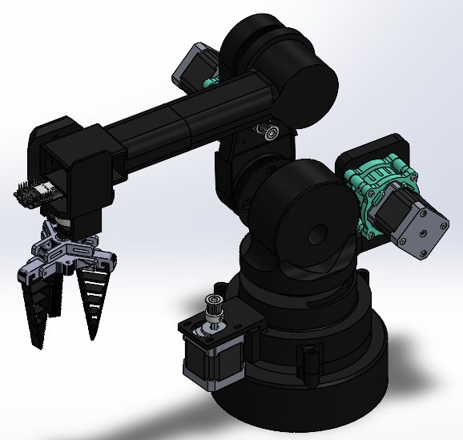
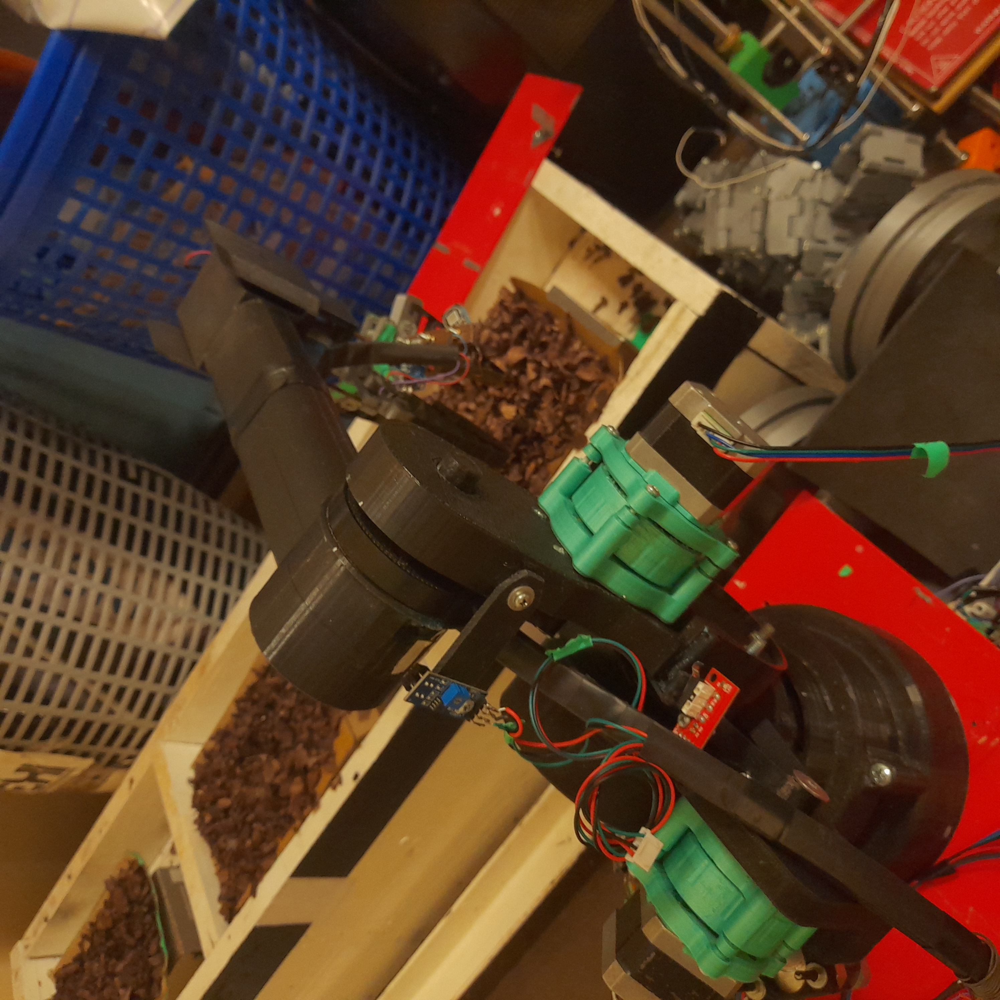
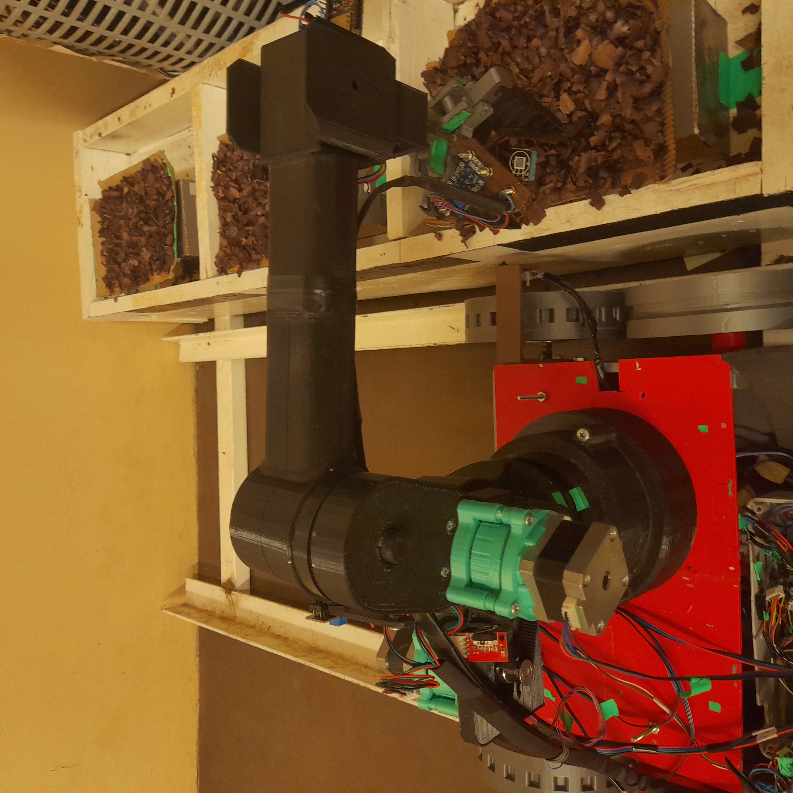
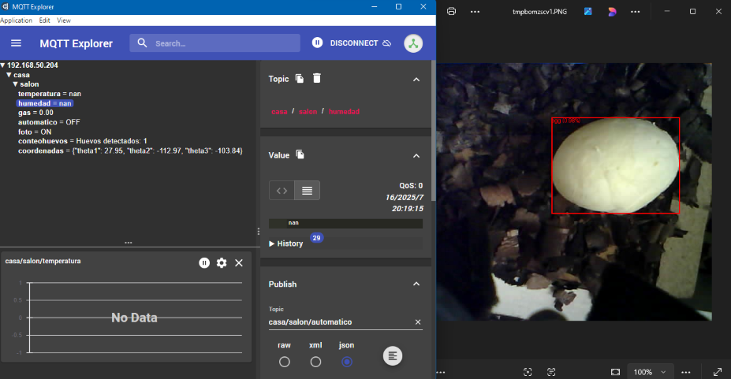
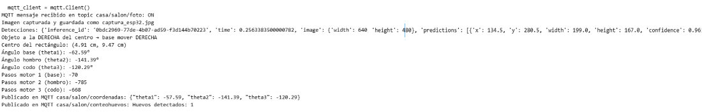
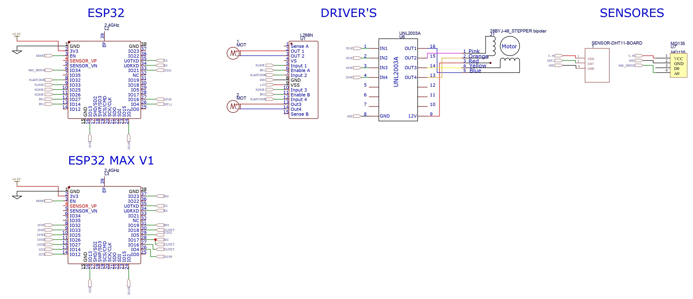
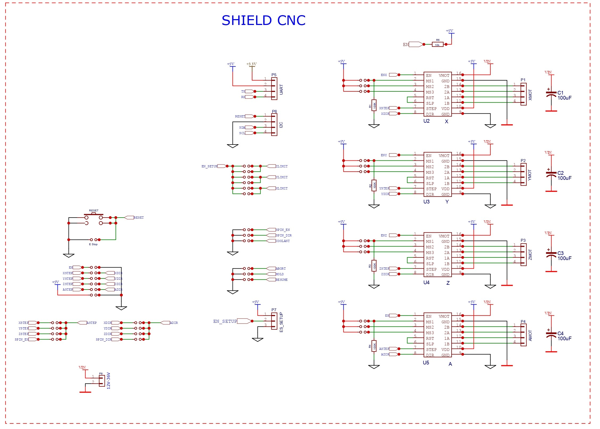
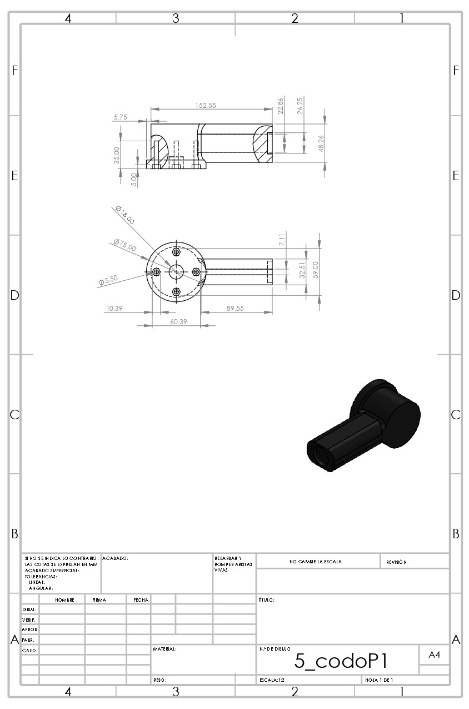

<h1 align="center" style="color:brown;">
  🐔🥚Robot Avícola V2.0
</h1>

Proyecto de la Práctica Profesional Supervisada "PPS" en Ingeniería Mecatrónica realizado en la FI-UNLZ.

Es un sistema robótico de 3 GDL para realizar la recolección de huevos en nidos horizontales, tiene implementado un software de procesamiento de imágenes para la detección y localización programado en python utilizando la librería cv2 y un modelo pre-entrenado de roboflow. Se emplea un Sistema IoT para el accionamiento de control, aplicación para el envío de mensajes y recepción a través de "MQTT", además del monitoreo de variables ambientales cómo la temperatura, gas CO2, húmedad.

  

## 🟠Tecnologías Aplicadas
• ESP32 - Shield cnc 3 ejes, para el robot se utilizan motores nema 17 con reductor planetario 5:1, motores eléctricos de cc para el carro que lo traslada y sensores de proximidad FC.
• Python - OpenCV, para el diseño de software de detección y calculo de la cinemática inversa.
• Node-RED - MQTT, para el envío y recepción de mensajes, aplicando los nodos se diseño un dashboard de control y monitoreo.
• Sensores de CO₂ MQ135, temperatura y humedad DHT11

## 🟠Prototipo REAL

  
  

## 🟠Procesamiento de Imágenes

Para la detección automática de huevos se utiliza un modelo de visión por computadora entrenado en la plataforma Roboflow. El flujo de trabajo se resume en las siguientes etapas:

### Captura de imagen:
  La cámara ESP32-CAM ubicada en el extremos del codo apuntando hacia abajo captura las imágenes en tiempo real enfocando el nido cubriendo toda la parte donde se ubica el huevo.
  La foto lo comprime en formato JPEG. Este archivo se transfiere a la PC. El resultado de este paso es un archivo ".jpg" accesible en el host.
### Inferencia con el modelo:
  Las imágenes capturadas son enviadas al modelo de Roboflow, el cual aplica un algoritmo de detección de objetos (YOLOv9). Como resultado, se obtiene un conjunto de predicciones que      incluyen:
  Clases detectadas (``huevo'').
  Confianza de detección (probabilidad asociada a la predicción).
  Coordenadas del recuadro:
  (x, y, w, h) donde $x$ e $y$ representan la posición central del objeto, mientras que $w$ y $h$ corresponden al ancho y alto del recuadro.

### Conversión a coordenadas del robot:
  A partir de las coordenadas $(x, y)$ obtenidas de la imagen (resolución de $640 \times 480$ píxeles), se realiza una transformación a coordenadas físicas reales del robot:
  (X_r, Y_r) = f(x, y)
  donde la función $f$ corresponde a la calibración que traduce los píxeles en coordenadas cartesianas, garantizando que el brazo robótico pueda posicionarse correctamente sobre el        huevo.

  • Conversión de píxeles a coordenadas físicas:

En el sistema de visión, las detecciones entregadas por el modelo de Roboflow
se expresan en coordenadas de imagen en píxeles. Para utilizar estos
datos en el control del robot, es necesario transformarlos a coordenadas físicas
(X,Y) medidas en centímetros sobre el plano de trabajo.

En una aproximación simple, se realiza una calibración lineal por
ejes independientes, donde se ajusta un factor de escala y un desplazamiento
(offset) a partir de puntos de referencia medidos experimentalmente:

$$
X = a_x \cdot u + b_x, \qquad
Y = a_y \cdot v + b_y
$$

donde:

  •  \(u,v\): coordenadas en píxeles de la detección
  
  •  \(X,Y\): coordenadas físicas en cm
  
  •  \(a_x, a_y\): factores de conversión (cm/px)
  
  •  \(b_x, b_y\): offsets de calibración

En el prototipo actual se obtuvieron los siguientes valores:

$$
X = (0.0328)\cdot u + 0.5, \qquad
Y = (0.0327)\cdot v + 0.3
$$

### Selección y validación:
  Se consideran válidas únicamente las detecciones cuyo nivel de confianza sea mayor a un umbral predefinido $0.40$. 
    
### Envío al sistema de control:
  Finalmente, con las coordenadas cartesianas corregidas $(X_r, Y_r)$ se calcula la cinemática inversa por método geométrico del robot RRR para luego transmitir los angulos por el protocolo MQTT al controlador del robot para luego ejecutar la secuencia de agarre y recolección.

  La salida del modelo Roboflow
  La predicción para un huevo detectado es el siguiente:
  "predictions": 
      "class": "egg",
      "confidence": 0.89,
      "x": 320,
      "y": 240,
      "width": 50,
      "height": 60
Este resultado indica que se detectó un huevo con una confianza del $0.89$ en la posición $(320, 240)$. 

  

  

## 🟠Modelo matemático (Cinemática inversa) Robot

En los siguientes ítems se describe el modelo cinemático inverso aplicado al robot de 3GDL por método geométrico.

 🔹 Articulación de la base $$\(\theta_1)$$

Este ángulo se obtiene a partir de la proyección del punto de acción sobre el plano XY.  
Las rotaciones se consideran respecto al eje Z.

$Coordenadas (px, py)$

$$
\theta_1 = 2\arctan\left(\frac{py}{px}\right)
$$

🔹 Articulación del brazo $$\(\theta_2)$$

$$
A_1 = l_1 + l_2 \cos(\theta_3), \quad A_2 = l_2 \sin(\theta_3)
$$

La distancia proyectada sobre el plano XY es:

$$
d_p = p_x \cos(\theta_1) + p_y \sin(\theta_1)
$$

Relaciones trigonométricas:

$$
\sin(\theta_2) = \frac{p'_z A_1 - d_p A_2}{A_1^2 + A_2^2}
$$

$$
\cos(\theta_2) = \frac{d_p A_1 - p'_z A_2}{A_1^2 + A_2^2}
$$

Finalmente:

$$
\theta_2 = 2\arctan\left(\frac{\sin(\theta_2)}{\cos(\theta_2)}\right)
$$

🔹  Articulación del codo $$\(\theta_3)$$

Se ajusta en el plano vertical de la base, considerando la distancia entre el gripper y el extremo del codo.  

Paso1. Se calcula la coordenada corregida en Z:

$$\ p'_z = p_z - b \$$

Paso2. Distancia proyectada:

$$\ D^2 = p_x^2 + p_y^2 + (p'_z)^2 \$$

Paso3. Aplicando la ley de cosenos:

$$\cos(\theta_3) = \frac{D^2 - l_1^2 - l_2^2}{2 l_1 l_2}\$$

Paso4. Ángulo del codo:

$$\theta_3 = 2\arctan\left(\frac{\sqrt{1-\cos^2(\theta_3)}}{\cos(\theta_3)}\right)\$$

Configuración **codo arriba**

• Con estos tres coordenadas articulares $$\(\theta_1, \theta_2, \theta_3)\$$ se obtiene la **configuración del robot** para alcanzar cualquier punto dentro de su espacio de trabajo 17x13cm.

## 🟠Plano Electrónico
Aquí una vista general del diagrama electrónico principal del prototipo:

  

  

## 🟠Planos Mecánicos
Aquí una vista general de los planos del prototipo:

  
  

## 🟠Video del Prototipo en funcionamiento

[Link de Google Drive](https://drive.google.com/file/d/1ZrKL6yfj1HvtoRiwAzGiAirnJcBjSen1/view?usp=drive_link)

  

## Agradecimiento

Quiero agradecer al profesor de la materia Proyecto Mecatrónico LUKASZEWICZ, Cristian por su acompañamiento durante el desarrollo de este proyecto, el cual constituye una extensión del proyecto final de la carrera. La experiencia me permitió consolidar conocimientos en robótica, procesamiento de imágenes, aplicaciones de softwares de diseño y programación, para así aplicarlos de manera práctica, logrando resultados satisfactorios en la precisión del agarre del objeto gracias a la integración de conceptos fundamentales que se requerían. Este trabajo representa un paso importante en mí proceso de constante aprendizaje, fortaleciendo las bases para seguir avanzando hacia las ciencias aplicadas y la construcción de nuevos desarrollos tecnológicos que me vaya proponiendo. Un fuerte agradecimiento a la FI-UNLZ por permitirme formarme en esta casa de estudios, brindándome oportunidades de crecer en mí formación profesional.

  

