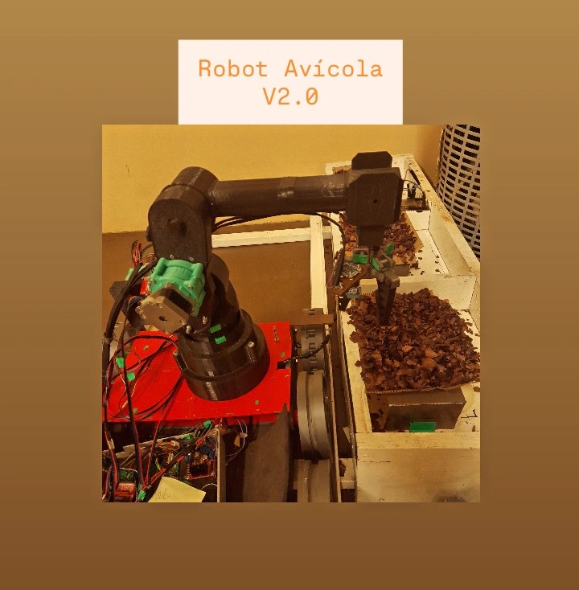

# 🐔🥚Robot Avícola V2.0

Proyecto de la PPS en Ingeniería Mecatrónica realizado en la FI-UNLZ.

Sistema robótico con visión artificial, IoT para detectar y recolectar huevos en nidos, implementación de monitoreo de variables ambientales temperatura, gas CO2, húmedad.

## 💻⚡ Tecnologías Aplicadas
• ESP32 - Shield cnc 3 ejes
• Python - OpenCV
• Node-RED - MQTT
• Sensores de CO₂ MQ135, temperatura y humedad DHT11

## 📸 Prototipo REAL

  

## 📐 Modelo matemático (Cinemática inversa) Robot
## 🔹 Articulación de la base \theta_1\)

Este ángulo se obtiene a partir de la proyección del punto de acción sobre el plano XY.  
Las rotaciones se consideran respecto al eje **Z**.

$$
\theta_1 = 2\arctan\left(\frac{py}{px}\right)
$$
